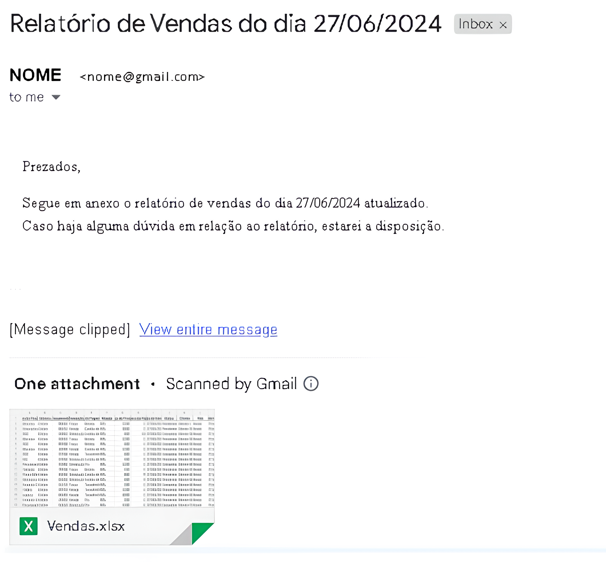
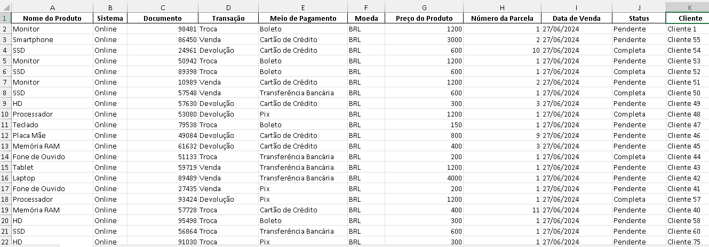

# Automação de Relatório de Vendas 🧾

O seguinte projeto desenvolvido em Python é uma automação que irá consolidar dados de vendas de produtos que estão em múltiplos arquivos CSV em um único arquivo Excel e enviar esse relatório por e-mail.

## Descrição do projeto 📌

O projeto de automação de relatório de vendas em Python visa simplificar e otimizar o processo de consolidação e distribuição de dados de vendas através de automação e enviando por email utilizando Outlook, tornando um processo mais prático e ágil. Além disso, traz os seguintes benefícios:

- **Economia de Tempo:** Reduz o tempo gasto na consolidação manual de dados.

- **Redução de Erros:** Minimiza erros na manipulação de grandes volumes de dados.

- **Melhoria da Eficiência:** Permite que os dados sejam consolidados e compartilhados rapidamente, melhorando a tomada de decisões.

## Tecnologias utilizadas 🖥️

- **pandas:** Biblioteca para manipulação e análise de dados, facilitando a leitura e escrita de arquivos CSV e Excel.

- **os:** responsável por operações de sistema, como navegação entre diretórios e listagem de arquivos.

- **datetime:** Para manipulação de datas.

- **win32com.client (pywin32):** realiza a  integração com o Microsoft Outlook, possibilitando o envio automatizado de e-mails.

## Como configurar e utilizar 🔧

1. Clone o repositório para sua máquina local:

```
git clone https://github.com/Robert-Cortez-Rudi/Automacao_Relatorio_Vendas.git
cd Automacao_Relatorio_Vendas
```

2. Agora dentro de um editor de código, instale as dependências do projeto:

```
pip install -r requirements.txt
```

3. Insira o email dentro do arquivo main.py que irá receber o email:

```
email.To = "" # Conta que receberá o email
```

4. Por fim, execute o arquivo main.py:

```
python main.py
```

**Obs:** Certifique-se de que seu Outlook esteja habilitado para realizar o email.

## Resultado Final 🔥





## Como ajudar com o projeto 💯

Caso encontre maneiras de tornar o código mais ágil e estruturado, abra uma issue ou envie um pull request para ajudar este projeto!!
